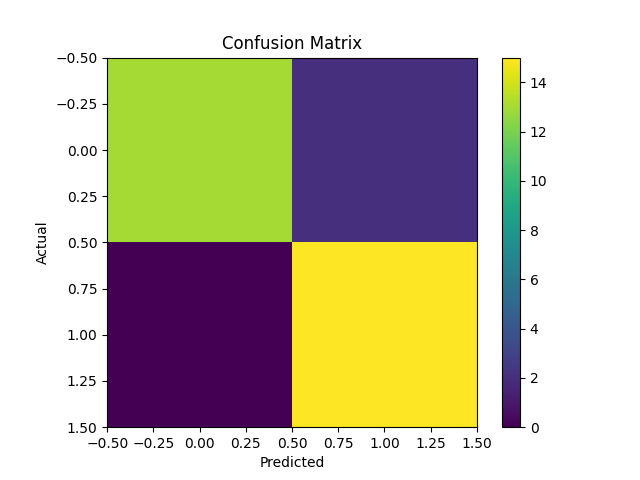

# Email-spam-detection
# Project Overview
This project is a simple Email Spam Detection System built using Machine Learning.The model classifies emails as:
Spam
Not Spam
It uses text preprocessing and classification techniques to achieve high accuracy.
# Problem Statement
Email inboxes receive many unwanted spam messages.
Manually filtering them is difficult and time-consuming.This project aims to automatically detect spam emails using machine learning.

# Objective
To classify emails as Spam or Not Spam.
To preprocess text data using NLP techniques.
To train a classification model.
To evaluate performance using accuracy and confusion matrix. 

# Technologies Used
Python – Programming language
Pandas – For handling dataset
Scikit-learn – For machine learning model
Matplotlib – For visualization

# Model Used – Logistic Regression
We used Logistic Regression because:
It is best for binary classification (Spam / Not Spam)
It works well with text data
It is simple and fast
It provides probability-based output

# How It Works
1.Load dataset
2.Clean and preprocess text
3.Convert text into numerical form using CountVectorizer
4.Split data into training and testing sets
5.Train logistic regression classifier
6.Evaluate using accuracy and confusion matrix

# Model Performance
Accuracy: 93%
1.True Positives: 13
2.True Negatives: 15
3.False Positives: 0
4.False Negatives: 2
The model performs well with minimal misclassification.

# output screenshot: 

